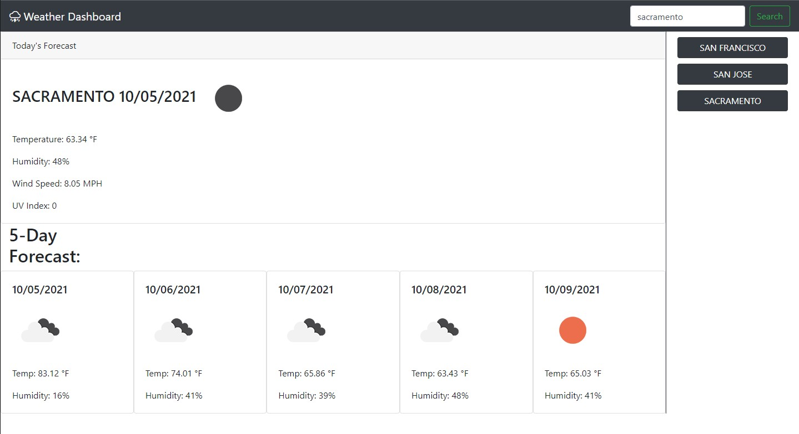

# Weather Dashboard

This app will give you the weather for the city that best matches your search. Just type the city you want on the top right and click search. The page will give you the temperature, humidity, wind speed, and UV index of the current day. It will also give you the forecast for the next five days. On the right side, there is a side bar that saves all your searches and will stay there even if you reload the page.

## Getting Started

* [Visit The Page Here](https://icortes.github.io/weather-dashboard/)

### Prerequisites

* Must have a web-browser.

### Installing

* No Installation required.

## Built With

* [HTML](https://developer.mozilla.org/en-US/docs/Web/HTML)
* [CSS](https://developer.mozilla.org/en-US/docs/Web/CSS)
* [Javascript](https://developer.mozilla.org/en-US/docs/Web/JavaScript)

## Deployed Link

* [See Live Site](https://icortes.github.io/weather-dashboard/)

## Authors

* **Isaac Cortes Hernandez** 

- [Link to Portfolio Site](https://icortes.github.io/my-first-portfolio/)
- [Link to Github](https://github.com/icortes)
- [Link to LinkedIn](https://www.linkedin.com/in/cortes-isaac)

## License

This project is licensed under the MIT License 

## Acknowledgments

* [OpenWeather API](https://openweathermap.org/api)
* Bootstrap
* JQuery
* Moment.js
